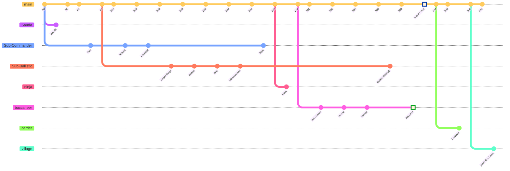
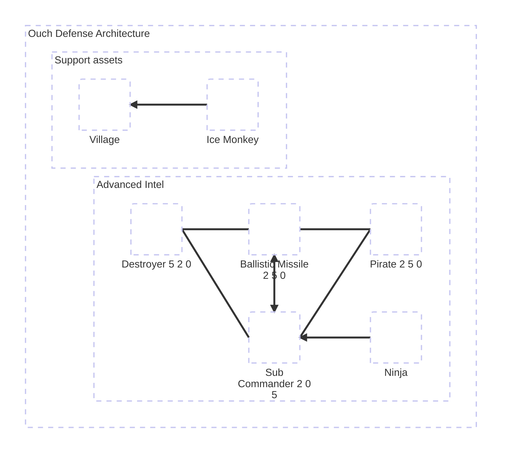

# #OUCH 
#### *0 to hero step by step duo chimps guide*

---

## Towers:

#### Hero
- Sauda
- (Churchill)

#### Water Towers
- Monkey Sub 2-5-0
- Monkey Sub 2-0-5
- Monkey Buccaneer 5-2-0
- Monkey Buccaneer 2-5-0

#### Support

- Village
- Ice Monkey 0-5-0

#### Other

- ninja

## Defense Timeline 

## Defese Architecture

